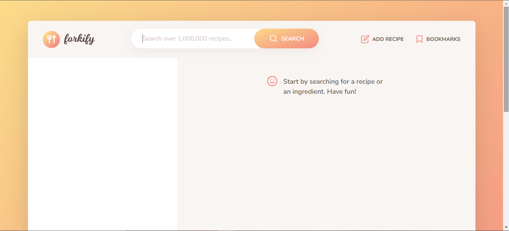
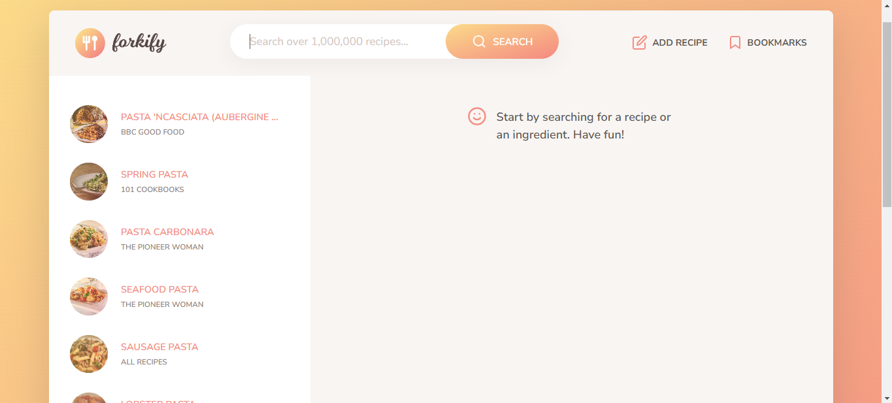
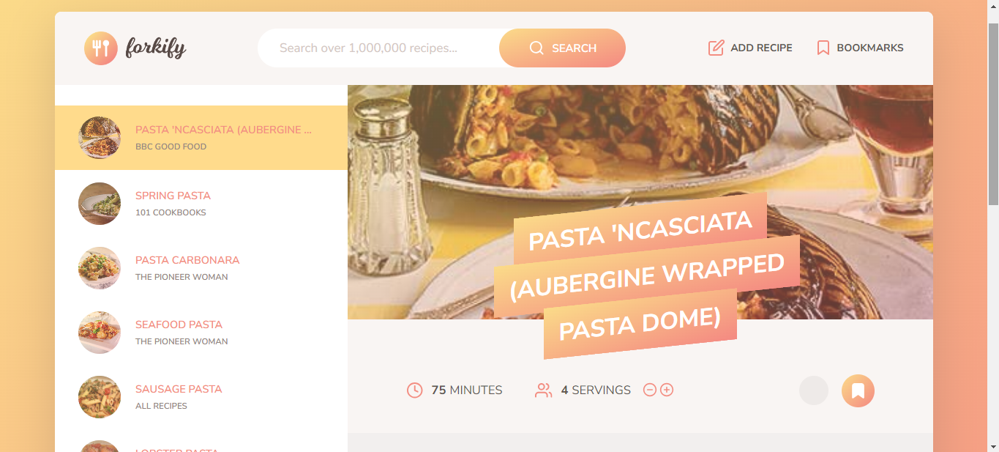
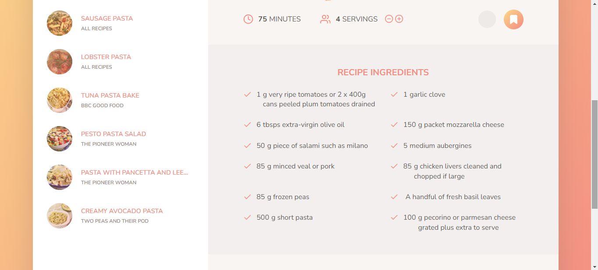
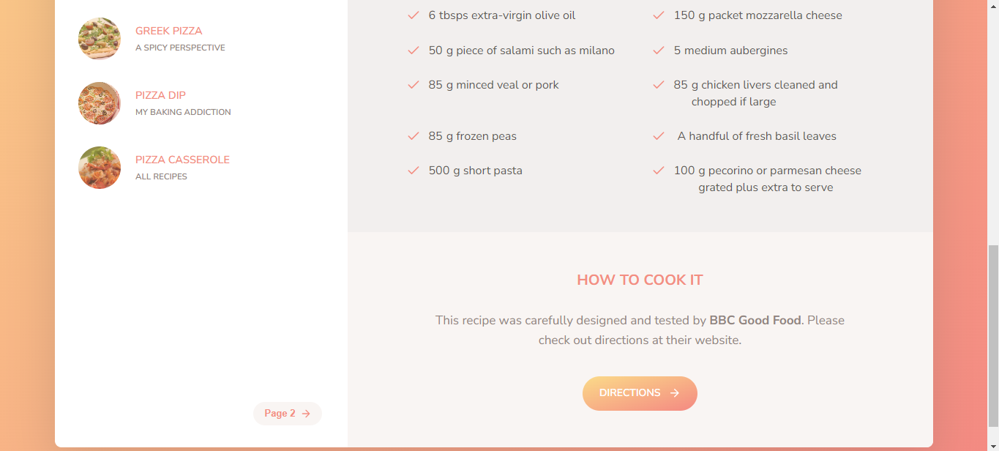

# Forkify-App
Bu uygulamada bir yemek tarif uygulamasını The Complate Javascript Course - 'Jonas Schmedtmann' eşliğinde  oluşturdum.

### Projenin canlı versiyonu :
  FORKIFY'I CANLIYA AL

###  1- 🙋‍♂️ Uygulamayı kullanabilmek için kullanabileceğiniz arama kelimeleri :
* pizza
* soup
* avacado
* x
* y
* z

### 2- 🛠 Uygulamayı oluştururken kullandığım teknolojiler :
* 
* 
* 
* 
* 
* 

### 4- 💻 Projenin kurulumu :
Projenin kurulumu için yüklenmesi gereken paketler :
#### Dev-Dependencies :
* parcel@^2.10.0
* @parcel/transformer-sass@^2.10.0
#### Dependencies :
* "core-js": "^3.33.1"
* "fractional": "^1.0.0"
* "regenerator-runtime": "^0.14.0"
